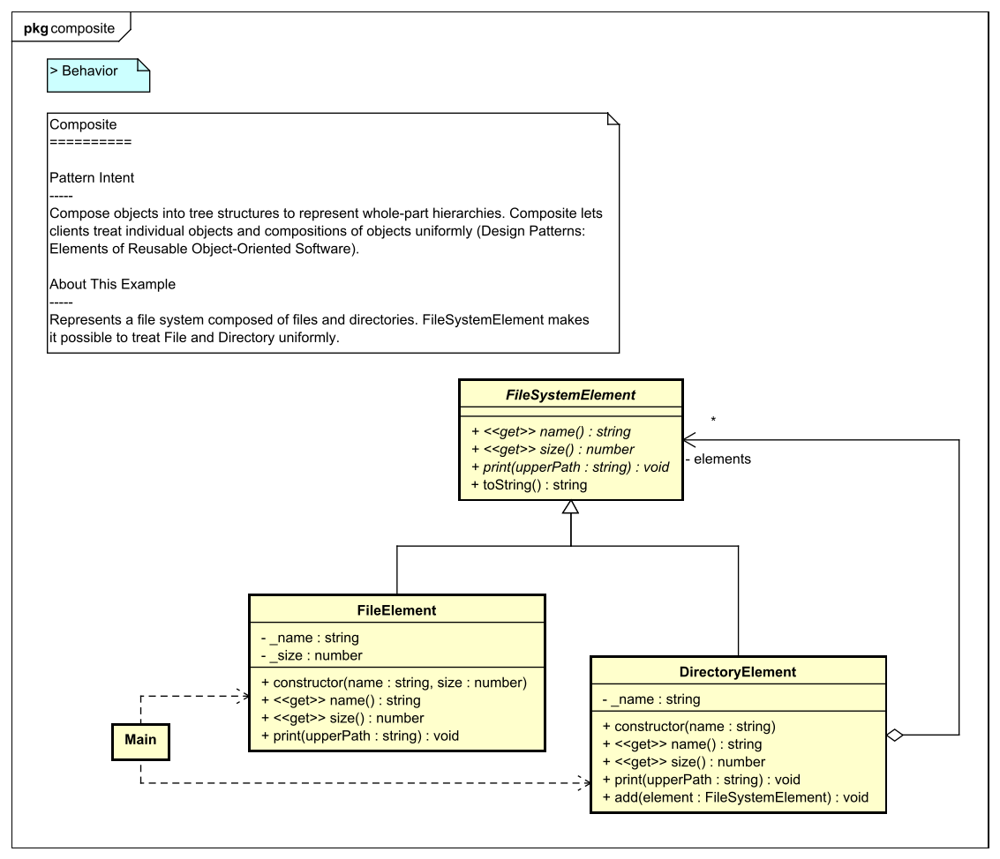
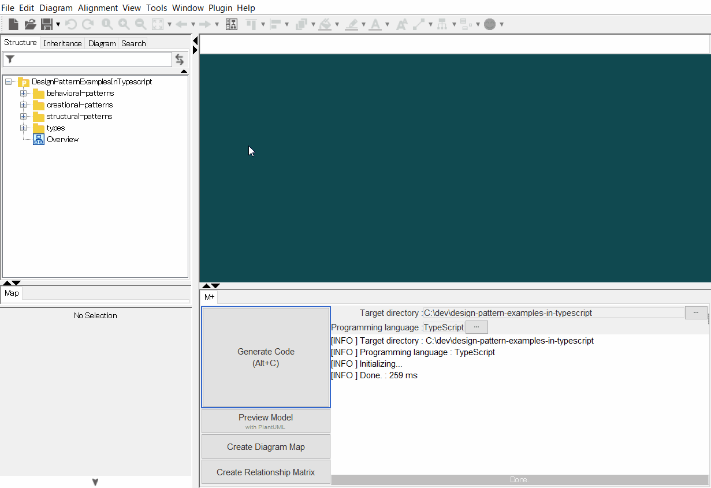
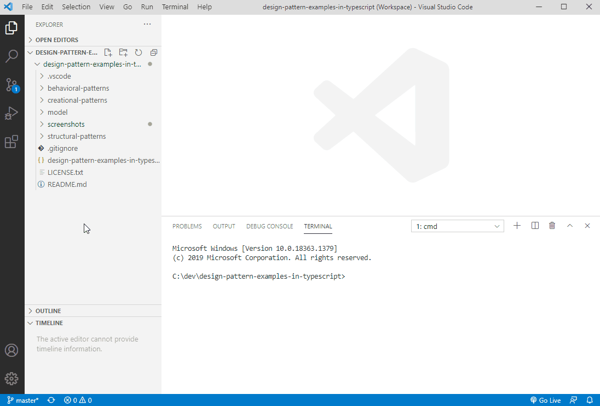
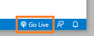
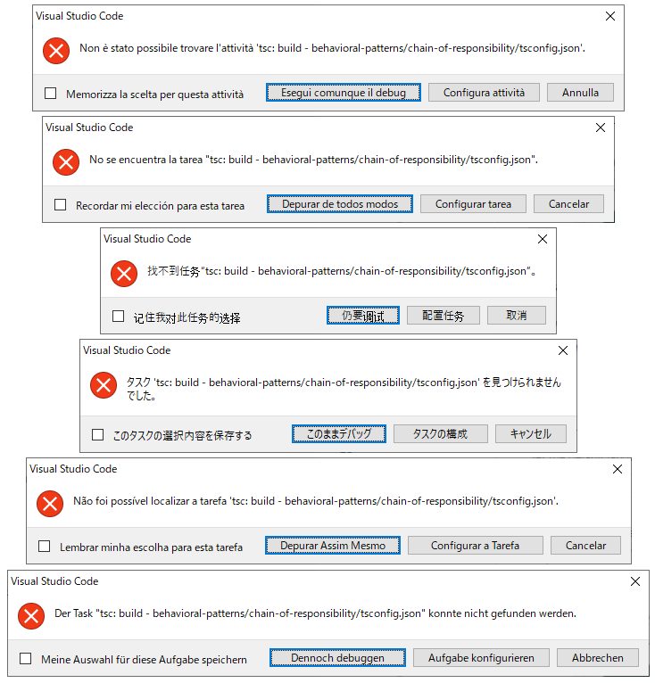

[](https://raw.githubusercontent.com/takaakit/design-pattern-examples-in-typescript/master/screenshots/DiagramMap.svg)

Design Pattern Examples in TypeScript
===

Model and code examples of GoF Design Patterns for TypeScript.  
This project is available for the following objectives:  

* To understand GoF Design Pattern examples in TypeScript.
* To understand the mapping between UML model and TypeScript code.
* To try Model-Driven Development (MDD) using Astah and M PLUS plug-in.

> UML model example:



<a id="code-example"></a>
> TypeScript code example:

```typescript
// ˅
'use strict';

import { FileSystemElement } from './file-system-element';

// ˄

export class FileElement extends FileSystemElement {
    // ˅
    
    // ˄

    private readonly _name: string;

    private readonly _size: number;

    constructor(name: string, size: number) {
        // ˅
        super();
        this._name = name;
        this._size = size;
        // ˄
    }

    get name(): string {
        // ˅
        return this._name;
        // ˄
    }

    get size(): number {
        // ˅
        return this._size;
        // ˄
    }

    // Print this element with the "upperPath".
    print(upperPath: string): void {
        // ˅
        console.log(`${upperPath}/${this.toString()}`);
        // ˄
    }

    // ˅
    
    // ˄
}

// ˅

// ˄
```

Installation
------------
**UML Modeling Tool**
* Download the modeling tool [Astah](https://astah.net/download) UML or Professional, and install.  
* Download [M PLUS](https://sites.google.com/view/m-plus-plugin/download) plug-in **ver.2.5.0** or higher, and add it to Astah.  
  [How to add plugins to Astah](https://astahblog.com/2014/12/15/astah_plugins/)

**TypeScript Development Environment**
1. Install [Visual Studio Code](https://code.visualstudio.com/download) **ver.1.46** or higher.
2. Install [Live Server](https://marketplace.visualstudio.com/items?itemName=ritwickdey.LiveServer) extensions for VS Code.
3. Install [Chrome](https://www.google.com/intl/en/chrome/) browser.
4. Install [Node.js](https://nodejs.org/en/) **ver.12.3.1** or higher.
5. Install TypeScript and type definitions with the following commands using npm.  
`cd <this directory (design-pattern-examples-in-typescript)>`  
`npm install typescript @types/node --save-dev`  

Usage
-----
**Code Generation from UML**
  1. Open the Astah file (model/DesignPatternExamplesInTypescript.asta).
  2. Select model elements on the model browser of Astah.
  3. Click the **Generate Code** button.  
    
  The generated code has **User Code Area**. The User Code Area is the area enclosed by "˅" and "˄". Handwritten code written in the User Code Area remains after a re-generation. [View code example](#code-example).  
  For detailed usage of the tools, please see [Astah Manual](https://astah.net/manual) and [M PLUS plug-in Tips](https://sites.google.com/view/m-plus-plugin-tips).

**Compile and Run**
  1. Open the workspace file (design-pattern-examples-in-typescript.code-workspace) in VS Code.
  2. Select the **Run** icon in the Activity Bar on the side of VS Code.
  3. Select the configuration named Launch Program using the Configuration drop-down in the Run view.
  4. Click the **Start Debugging** button.  
       

     *Note1*: Before running patterns **Command**, **Mediator**, and **State**, you need to click to Go Live from the status bar to turn a server on. After running those patterns, click again to turn the server off.  
     

     *Note2*: If you encounter these error messages, change the VS Code display language to "en" and restart VS Code.  
     [How to change the display language](https://code.visualstudio.com/docs/getstarted/locales#_changing-the-display-language)  
     

  For detailed usage of the tools, please see [Astah Manual](https://astah.net/manual) and [M PLUS plug-in Tips](https://sites.google.com/view/m-plus-plugin-tips).

References
----------
* Gamma, E. et al. Design Patterns: Elements of Reusable Object-Oriented Software, Addison-Wesley, 1994
* Hiroshi Yuki. Learning Design Patterns in Java [In Japanese Language], Softbank publishing, 2004

Licence
-------
This project is licensed under the Creative Commons Zero (CC0) license. The model and code are completely free to use.

[](https://creativecommons.org/publicdomain/zero/1.0/deed)

Other Language Examples
-----------------------
[C++](https://github.com/takaakit/design-pattern-examples-in-cpp), [C#](https://github.com/takaakit/design-pattern-examples-in-csharp), [Crystal](https://github.com/takaakit/design-pattern-examples-in-crystal), [Go](https://github.com/takaakit/design-pattern-examples-in-golang), [Java](https://github.com/takaakit/design-pattern-examples-in-java), [JavaScript](https://github.com/takaakit/design-pattern-examples-in-javascript), [Kotlin](https://github.com/takaakit/design-pattern-examples-in-kotlin), [Python](https://github.com/takaakit/design-pattern-examples-in-python), [Ruby](https://github.com/takaakit/design-pattern-examples-in-ruby), [Scala](https://github.com/takaakit/design-pattern-examples-in-scala), [Swift](https://github.com/takaakit/design-pattern-examples-in-swift)
